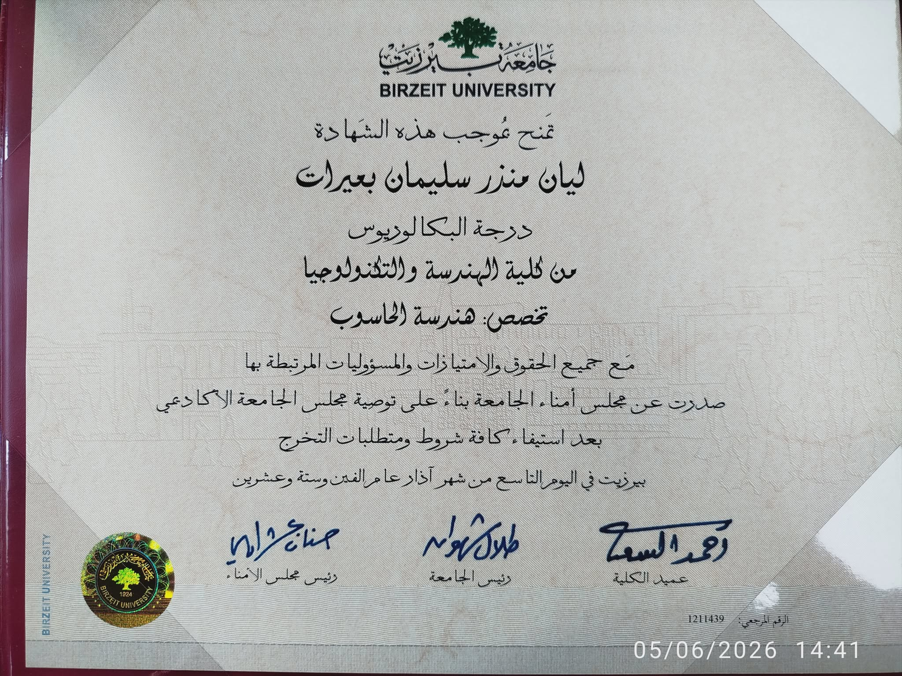
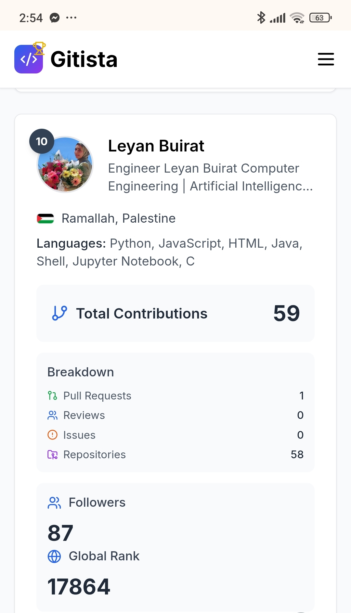

# 👨‍💻 Layan Buirat | Computer Engineering Graduate | AI Specialization
شش

 

  

---

<h2 align="center"> 💡 Profile Views </h2>

  

  
  

---

<h3 align="center">
    Computer Engineering - AI Specialization | Full-Stack Developer | BI & Analytics Engineer | Azure AI Enthusiast
</h3>

---

🎓 Recent Computer Engineering graduate (4.5 years instead of 5) with AI specialization, passionate about transforming raw data into actionable insights. I build scalable data architectures, develop interactive dashboards, and create intelligent applications that bridge the gap between technical capabilities and business value.

---
## 🎓 **Education & Certification**

  </table>
    <tr>
      <td align="center" width="33%">
         
        <b>B.Sc. in Computer Engineering - AI Specialization</b> Birzeit University | 2021-2026 Completed in 4.5 years | Graduation Project: 90/100
      </td>
      <td align="center" width="33%">
         
        <b>Intro to Machine Learning with TensorFlow 🎉</b> Udacity | Palestine Launchpad with Google & Accenture 
        📚 Supervised & Unsupervised Learning | TensorFlow & Neural Networks | PCA, K-Means 
        🏆 Projects: CharityML, Customer Segmentation, Flower Image Classifier (102 species) 
        🔗 <a href="https://www.udacity.com/certificate/e/6b5662a6-0060-11f1-8b63-077ddb6a45c5">Verify Certificate</a>
      </td>
      <td align="center" width="33%">
         
        <b>GitHub Global Rank</b> #57 in Palestine | Global Rank: 17,864 <a href="https://github.com/layanbuirat">@layanbuirat</a> | 87 Followers
      </td>
    </tr>
  </table>

---

<h2 align="center"> 🚀 Core Technologies </h2>

  

  

  

---

<h2 align="center">🏆 Featured Project: 🌸 Flower Image Classifier</h2>

**A Deep Learning Image Classifier that identifies 102 different flower species using Transfer Learning (MobileNetV2) and the Oxford Flowers 102 dataset.**

| 📊 **Key Metrics** | |
|---|---|
| **Model Architecture** | MobileNetV2 (Pre-trained) → GlobalAvgPooling → Dense(128) → Dropout(0.2) → Dense(102) |
| **Test Accuracy** | **72.6%** on 6,149 unseen images |
| **Dataset** | 8,189 images (1,020 Train / 1,020 Val / 6,149 Test) |
| **Achievements** | Achieved strong generalization with only ~3% gap between Train (95.4%) and Validation (74.5%) |
| **Formats Exported** | Keras (.h5), TensorFlow SavedModel, TensorFlow Lite (.tflite) |

**🔧 Technical Implementation:**
- **Framework:** TensorFlow / Keras
- **Technique:** Transfer Learning with MobileNetV2 (frozen base)
- **Regularization:** Dropout(0.2) to prevent overfitting
- **Optimization:** Adam optimizer, Sparse Categorical Crossentropy

  

---

## 📌 Other Key Projects

### 🤖 **AI & Machine Learning**
- **🌿 Flower Image Classifier:** *[رابط المشروع أعلاه]* - 102 flower species classification using Transfer Learning (MobileNetV2, 72.6% test accuracy)
- **🍽️ MealLense (Graduation Project - 90/100):** AI-powered meal recognition system using Azure Custom Vision (93.4% precision, 61,906 images, 223 food categories) - [GitHub](https://github.com/layanbuirat/Graduation-Project-MealLense-Mobile-App-with-Website-Development-FAQ-Message-management-)
- **📚 Arabic Question Answering (LLM & NLP):** Fine-tuned AraElectra model for Arabic QA on AAQAD dataset - [GitHub](https://github.com/layanbuirat/Arabic-question-answering-LLM-NLP-)
- **☁️ Azure Document Intelligence ETL Pipeline:** Built automated document processing pipeline during ASAL internship - [GitHub](https://github.com/layanbuirat/Azure-Document-Intelligence-Azure-AI-Language-OpenAI-Processing-Workflow)

### 🏗️ **Backend Systems (C# / .NET Core - 8+ Projects)**
- **🛒 E-Commerce Web API (ASP.NET Core 9):** Complete backend with JWT auth, role-based access (Customer/Owner/Admin) - [GitHub](https://github.com/layanbuirat/Ecommerce-Web-API)
- **📦 Food Delivery API:** Order tracking, restaurant management, Swagger documentation - [GitHub](https://github.com/layanbuirat/FoodDelivery-ASP.NET-Core-Web-API)
- **🏢 Department & Employee Manager API:** CRUD operations, DTO pattern, Entity Framework Core - [GitHub](https://github.com/layanbuirat/DeptEmpManager-API)
- **🛍️ KASHOP E-Commerce MVC:** Full MVC app with Repository Pattern, N-Tier Architecture - [GitHub](https://github.com/layanbuirat/ShopHub-MVC)

### 📊 **Data & Analytics**
- **📚 Library Management System (LMS):** Normalized SQL schema, role-based auth, transaction tracking - [GitHub](https://github.com/layanbuirat/LMS-Library-Management-System-)
- **🚴 BikeStores SQL Database:** Complex queries, stored procedures, indexing strategies - [GitHub](https://github.com/layanbuirat/SQL-Server-sample-database-called-BikeStores)
- **🐍 Data Analysis with Pandas:** Comprehensive data processing and analysis - [GitHub](https://github.com/layanbuirat/Data-Analysis-with-Pandas)

### 🎨 **Frontend & Full-Stack**
- **🪑 Wafa'a Furniture (Full-Stack E-commerce):** Node.js/Express backend + responsive frontend, JWT auth - [Live Demo](https://layanbuirat.github.io/fullstack-ecommerce-product-management-app/) | [GitHub](https://github.com/layanbuirat/fullstack-ecommerce-product-management-app)
- **📱 MealLense Web Platform + Admin Dashboard:** HTML/CSS/JS/Firebase, bilingual FAQ system, real-time admin stats - [Live Demo](https://meallense-website-help.onrender.com)
- **⚛️ React SPA:** Dynamic single-page application with React Router - [Live Demo](https://single-page-application-spa-using-react-3vht.onrender.com) | [GitHub](https://github.com/layanbuirat/Single-Page-Application-SPA-using-React-Router)
- **💍 Jewellery Shop UI:** Responsive e-commerce catalog design - [Live Demo](https://layanbuirat.github.io/JewelleryShop/)

### 📱 **Mobile Development**
- **💰 FinTrack (Android):** Native finance manager with SQLite (normalized, 4 tables), SHA-256 hashing, data visualization charts - [GitHub](https://github.com/layanbuirat/FinTrack-project-of-lab-Android)
- **🍽️ MealLense Mobile App (Flutter):** Cross-platform app with Firebase (Auth, Firestore, Storage), multi-database architecture - [GitHub](https://github.com/layanbuirat/Graduation-Project-MealLense-Mobile-App-with-Website-Development-FAQ-Message-management-)

### ⚙️ **Systems & Low-Level**
- **🔌 Low Power Comparator (VLSI):** GDI technique, 22nm technology – 8-bit comparator: 18.25μW, 49ps - [Report](https://github.com/layanbuirat/8-bit-low-power-comparator-using-GDI-technique-with-22nm-technology)
- **🌐 Linux Systems Programming (gNMI-CLI):** Python framework for network telemetry validation - [GitHub](https://github.com/layanbuirat/gNMI-path-validation-with-python)
- **🎮 Tug of War Simulation (C & Linux):** Real-time game with multi-processing (fork, exec), IPC (pipes, signals) - [GitHub](https://github.com/layanbuirat/Tug-of-War-game-using-C-and-Linux)
- **☕ Java Spring Boot Backend Systems (3 Projects):** RESTful APIs with JPA/Hibernate, MySQL - [GitHub](https://github.com/layanbuirat/Spring-Boot-relationship-mapping-)

---

<h2 align="center">💼 Professional Experience</h2>

| Company | Role | Duration | Key Contributions |
|---|---|---|---|
| **ASAL Technologies** | AI Development Internship | Jun 2025 - Sep 2025 | • Built ETL pipelines for AI-powered educational app • Integrated Azure AI services (Document Intelligence, OpenAI) • **Key Achievement:** Automated document processing pipeline |
| **GridAPP** | Full-Stack Development Internship | Mar 2025 - Jul 2025 | • Developed "Wafa'a Furniture" e-commerce platform • Implemented JWT authentication & RESTful APIs (Node.js/Express) |
| **Knowledge Academy** | Full-Stack Development Course | Jul 2024 - Dec 2025 | • System analysis, requirements gathering, technical documentation • Database schema design & software development lifecycle (SDLC) |

---

<h2 align="center">🎓 Continuous Learning Journey (1.5+ Years)</h2>

- **Front-End (Jul 2024 - Present):** HTML/CSS/JS → React → Responsive Design → Figma UI/UX (10+ projects)
- **Back-End (Mar 2025 - Present):** C#, .NET Core, ASP.NET Web API, Entity Framework, SQL Server (8+ projects)
- **Git & Leadership:** Managed all repositories, led graduation project team (3 members), resolved conflicts, maintained clean commit history

---

<h2 align="center">📊 GitHub Analytics</h2>

  
  

  

---

<h2 align="center">🌍 Languages</h2>

   <b>Arabic:</b> Native &nbsp;&nbsp;&nbsp;&nbsp;
   <b>English:</b> Good (reading, writing, speaking)

---

## 📞 Contact & Availability

  
| | |
|---|---|
| **📧 Email** | mlayan774@gmail.com |
| **📱 Phone** | +972 598 214 350 |
| **📍 Location** | Ramallah, Palestine |
| **📅 Availability** | **Full-time from February 2, 2026** |
| **🔗 LinkedIn** | [linkedin.com/in/ليان-بعيرات-50a186274](https://www.linkedin.com/in/%D9%84%D9%8A%D8%A7%D9%86-%D8%A8%D8%B9%D9%8A%D8%B1%D8%A7%D8%AA-50a186274/) |

---

## ⭐ Let's Connect & Build Data-Driven Solutions!

**💼 Open to BI & Analytics Engineer and Full-Stack Developer roles**  
**📅 Available for full-time positions from February 2, 2026**

---

  

